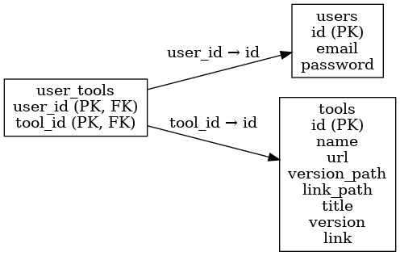

# Changelog Notifier Project V1
Here’s a corrected and improved version of the sentence:

With this project, you can receive email notifications about changelogs for your favorite tools. You can add any tool you want to receive updates for via email whenever it changes.

## Installation
I recommend creating a Python virtual environment:

```
python -m venv <env name>
cd <env name>
source bin/activate
```

## How it works

## Database
### The database structure :
There are three tables: `tools`, `users`, and `user_tools`.

The `tools` table contains all the information needed to scrape the webpage of a tool.

The `user_tools` table associates users with tools, allowing a user to be linked to multiple tools.

### Tables architechture :

### Commands to create postgres tables :
```
CREATE TABLE users (
    id SERIAL PRIMARY KEY,
    email VARCHAR(255) UNIQUE NOT NULL,
    password VARCHAR(255) NOT NULL
);

CREATE TABLE tools (
    id SERIAL PRIMARY KEY,
    name VARCHAR(255) UNIQUE NOT NULL,
    url VARCHAR(255) NOT NULL,
    version_path VARCHAR(255) NOT NULL,
    link_path VARCHAR(255) NOT NULL,
    title VARCHAR(255) NOT NULL,
    version VARCHAR(255) NOT NULL,
    link VARCHAR(255) NOT NULL
);

CREATE TABLE user_tools (
    user_id INTEGER NOT NULL,
    tool_id INTEGER NOT NULL,
    PRIMARY KEY (user_id, tool_id),
    FOREIGN KEY (user_id) REFERENCES users (id) ON DELETE CASCADE,
    FOREIGN KEY (tool_id) REFERENCES tools (id) ON DELETE CASCADE
);
```
### JSON file structure :
The JSON file is used to define the SMTP sender account and the database credentials.
```
{
  "smtp": {
    "server": "",
    "password": "",
    "from": ""
  },
  "database": {
    "name": "",
    "user": "",
    "password": ""
  }
}
```
